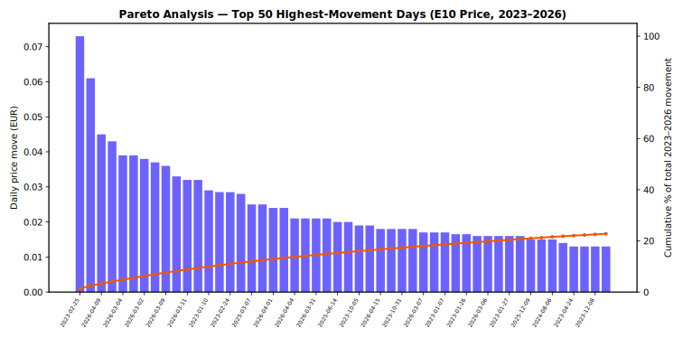

# Petrol Price Forecasting — Germany E10 (2023–2026)

Case study project comparing four forecasting approaches on Germany's daily E10 petrol
price. Built as part of my analytics portfolio at [gimeno.tech](https://www.gimeno.tech/petrol-forecast).

## Business problem

Fuel price volatility affects operational cost planning. This project evaluates whether
simple, classical, and deep-learning forecasting methods can produce useful short-term
price scenarios for planning purposes.

## Approach

1. **Ingest** daily E10/Super/Diesel price data for Germany (source: BMWK fuel price data).
2. **Clean & resample** to a continuous daily series, interpolating any gaps.
3. **Forecast** the next 30 days with four independent models:
   - Linear Regression on lagged prices
   - ARIMA
   - LSTM (deep learning, sequence-based)
   - AutoKeras (automated neural architecture search)
4. **Compare** all four forecasts against the actual series in one integrated chart.
5. **Export** each chart as a standalone interactive HTML file for the portfolio site.

## Repo structure

```
petrol-forecasting/
├── data/incoming/                     Raw source CSV
├── notebooks/                         End-to-end analysis notebook
├── bots/                              Reusable pipeline components
│   ├── ingestion_bot.py               Generic CSV/Excel loader
│   ├── petrol_transform_bot.py        Cleaning + daily resampling
│   ├── petrol_linear_forecast_bot.py  Linear Regression forecaster
│   ├── petrol_arima_forecast_bot.py   ARIMA forecaster
│   ├── petrol_lstm_forecast_bot.py    LSTM forecaster
│   ├── petrol_autokeras_forecast_bot.py  AutoKeras forecaster
│   ├── petrol_visualization_bot.py    Dark-theme Plotly chart builder
│   └── petrol_pipeline_bot.py         Orchestrates the full workflow end-to-end
```

The interactive charts this notebook produces are published live at
[gimeno.tech/petrol-forecast](https://www.gimeno.tech/petrol-forecast) rather than duplicated
in this repo — running the notebook regenerates them locally as standalone HTML files.

## Running it

```bash
pip install -r requirements.txt
jupyter notebook notebooks/"Petrol_Forecasting_Project_2023-2026.ipynb"
```

Running all cells top to bottom reproduces every chart (saved to a local `charts/` folder,
git-ignored) from the raw data in `data/incoming/`. Paths are resolved relative to the
project root, so it runs the same whether you launch it from the repo root or from inside
`notebooks/`.

Alternatively, run the whole pipeline in three lines via the orchestrator bot:

```python
from bots.petrol_pipeline_bot import PetrolPipelineBot

pipeline = PetrolPipelineBot()
result = pipeline.run_pipeline(
    file_path="data/incoming/GES_Deutschland_2023-2026.csv",
    models=["linear", "arima", "lstm", "autokeras"],
    days=30
)
```

## Key findings

- Petrol prices were relatively stable through most of 2023–2025, with a sharp upward
  shift emerging in early 2026.
- No single model dominates: Linear Regression and ARIMA track the recent trend closely
  over short horizons, while LSTM and AutoKeras better capture nonlinear shifts but carry
  more forecast uncertainty further out.
- Recommendation: treat these outputs as scenario bands for planning rather than a single
  point forecast, and re-run the pipeline regularly as new daily data arrives.

## Pareto analysis

Does price volatility concentrate in a small number of high-movement days, the way the
80/20 rule would predict? Days are ranked by absolute day-over-day price change and plotted
against their cumulative share of total movement:



**Moderate concentration, not a strict 80/20 split.** The top 20% of trading days (242 of
1,208) account for **54.2%** of the total cumulative price movement over 2023-2026, and it
takes **44.4%** of all days to reach 80% of total movement. That's meaningfully more
concentrated than a uniform distribution (where 20% of days would account for only 20% of
movement), but it falls short of a textbook 80/20 pattern. A relatively compact set of
high-volatility days drives a disproportionate share of total price movement — these are the
periods where forecast error is likeliest to spike, and where re-forecasting attention is
most valuable, rather than treating every day as equally unpredictable.

## Notes

This is a from-scratch analytics/portfolio project — it is not a general-purpose
forecasting library. The `bots/` classes are intentionally scoped to this dataset's shape
and are reused across the notebook and the pipeline orchestrator to avoid duplicating
logic.
